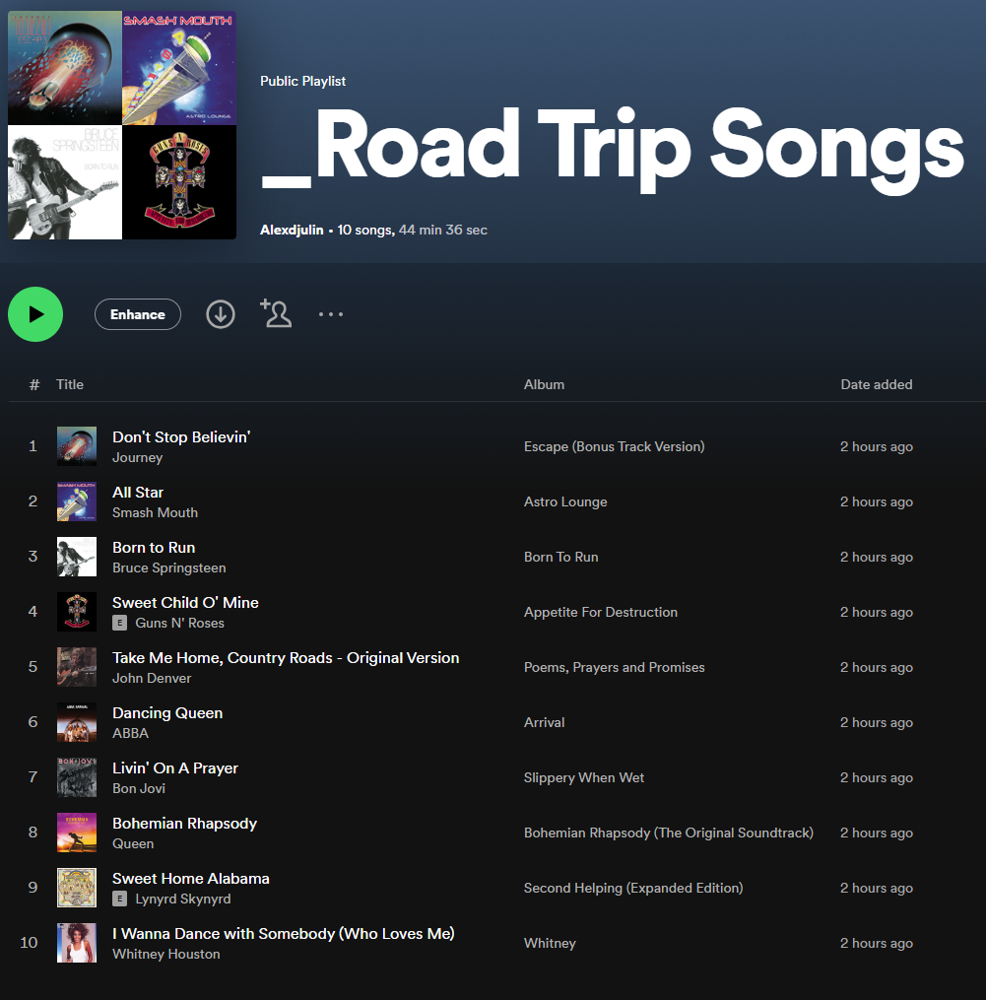
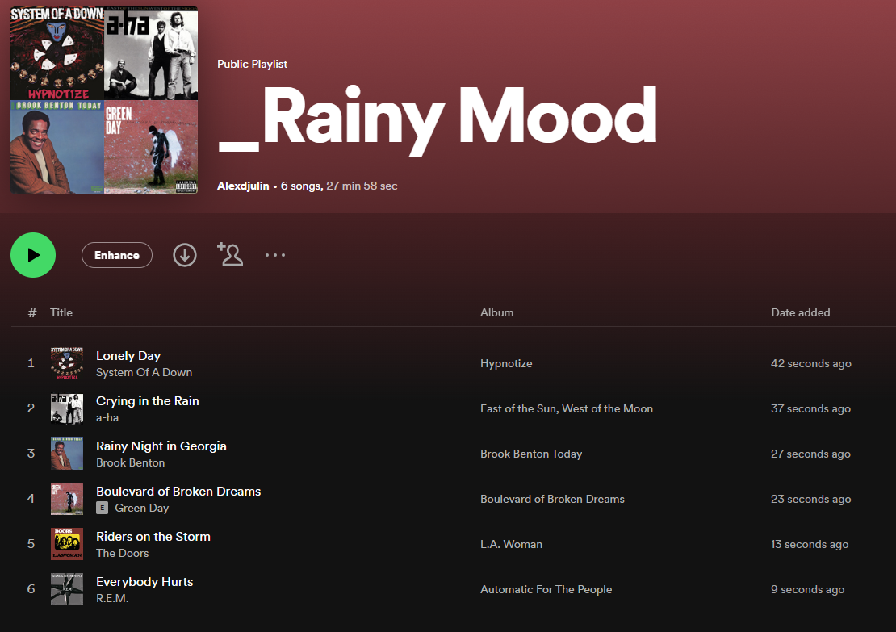

# Spotify Playlist Generator
_A command-line tool to generate Spotify playlists based on ChatGPT prompts._


## Project description
The goal of this simple project was to learn how to interact with the [OpenAI](https://github.com/openai/openai-python) API and get useful information from ChatGPT in a format I can easily manipulate (json dictionaries of artists and songs). On the other side, it is using the [Spotipy](https://spotipy.readthedocs.io/en/2.22.1/) module to interact with Spotify and create playlists. Linked together, these two modules can help you create creative playlists from songs suggested by ChatGPT according to a given prompt (Example: "Peaceful songs to listen to when it's raining"). It's a great way to discover new tunes.

This project is built upon a tutorial by [Colt Steele: Mastering OpenAI Python APIs](https://www.udemy.com/course/mastering-openai/) that I highly recommand, as it covers the basics of how ChatGPT is working and how to interact with it. On top of the automatic playlist creation mode covered by the tutorial, I created an interactive mode, which lets you decide which songs should be added and gives you the possibility to blacklist artists and songs. I completed the project with additional methods to play and print playlists.

## Prerequisites
To use this tool, you need both an OpenAI and a Spotify Developper account.

### OpenAI
It's the company who created and offers access to different ChatGPT models. Go to the [OpenAI website](https://platform.openai.com/signup) and create an account. It comes with some free credit to start and test the API. See [documentation](https://platform.openai.com/docs/quickstart?context=python) to generate your own API-Key.

### Spotify
Create a [Spotify account](https://www.spotify.com/us/signup) if you don't already have one, it's free. After that, login to [Spotify for Developers](https://developer.spotify.com/) and create a project. In the project settings, you can generate the client-ID and -Secret needed to connect and send requests to Spotify. See the [documenation](https://developer.spotify.com/documentation/web-api/tutorials/getting-started) for more infos.

Once you have your own credentials to access both APIs, you can add them to playlist_generator.py. I am using the [keyring](https://pypi.org/project/keyring/) module to store and retrieve mine, but you can use an .env file, store them in environment variables or just use them directly in the code. In this last case, be careful not to share your code with anyone!

```python
# Set openai key
openai.api_key = keyring.get_password('openai_key', 'main_key')
# Set spotify client id and secret
client_id=keyring.get_password('spotify', 'client_ID')
client_secret=keyring.get_password('spotify', 'client_secret')
```

### Spotify Desktop
If you want to be able to play songs during the playlist creation (in the interactive mode for instance), you will need [Spotify Desktop](https://www.spotify.com/us/download/) installed on your machine. If you want to skip this part, comment all calls to the method _play_song_in_spotify()_ in playlist_generator.py, as it will not be able to ask your Spotify player to play the given songs.

## Installation

Clone project and install required libraries (in a virtual environment for instance)
```python
git clone https://github.com/alexdjulin/spotify-playlist-generator.git
python -m venv venv
venv\Scripts\activate # on windows
source venv/bin/activate # on macOS/linux
pip install -r requirements.txt
```

## How to use it

The most convenient way to start the playlist generator is to call main.py. 

```
python main.py
```

It will ask for the 4 required input variables:  

+ **Playlist Prompt** (-p):  
A short description sent to ChatGPT to generate the playlist. Example: _Best songs for a road trip with your best friend._  
+ **Playlist Length** (-l):  
How many songs should be in the playlist. Default is 10.  
+ **Playlist Name** (-n):  
The playlist name on Spotify. Optional, leave blank to use the prompt as name. Example: _Road Trip Songs_.  
+ **Interactive Mode** (-i):  
Y to activate or N to deactivate the interactive mode. When active, each song will be played in Spotify and the user can choose to Add the song, blacklist it or blacklist the artist.

```
Playlist Prompt: Best songs for a road trip with your best friend
Playlist/Batch Length: 10
Playlist Name (leave blank to use prompt): Road Trip Songs
Interactive Mode? [y]es or [n]o: n
Creating playlist. Please wait...
>> end of playlist creation
```

Additionnally you can call playlist_generator.py and pass these arguments in the command line directly. Don't forget the quotes around the strings. The interactive mode flag is TRUE if you pass -i, FALSE if you dont pass it:
```bash
# interactive flag off
python playlist_generator.py -p "Best songs for a road trip with your best friend" -l 10 -n "Road Trip Songs"
# interactive flag on
python playlist_generator.py -p "Best songs for a road trip with your best friend" -l 10 -n "Road Trip Songs" -i
```

## Automatic Playlist Creation

When interactiv mode is off, the playlist is created and filled automatically. It is great to create quick playlists, without worrying too much about the contents... Providing that you trust ChatGPT's suggestions, which can be sometimes surprising!

Output when interactive mode is off:
```
----------------------------------------------------------------------------------------------------
------------------------------------ SPOTIFY PLAYLIST GENERATOR ------------------------------------
----------------------------------------------------------------------------------------------------
Prompt: Best songs for a road trip with your best friend
Length: 10
Name: Road Trip Songs
Interactive: False
----------------------------------------------------------------------------------------------------
1. Journey - Don't Stop Believin' | Escape (Bonus Track Version)
2. Smash Mouth - All Star | Astro Lounge
3. Bruce Springsteen - Born to Run | Born To Run
4. Guns N' Roses - Sweet Child O' Mine | Appetite For Destruction
5. John Denver - Take Me Home, Country Roads - Original Version | Poems, Prayers and Promises
6. ABBA - Dancing Queen | Arrival
7. Bon Jovi - Livin' On A Prayer | Slippery When Wet
8. Queen - Bohemian Rhapsody | Bohemian Rhapsody (The Original Soundtrack)
9. Lynyrd Skynyrd - Sweet Home Alabama | Second Helping (Expanded Edition)
10. Whitney Houston - I Wanna Dance with Somebody (Who Loves Me) | Whitney
----------------------------------------------------------------------------------------------------
```

Spotify should open automatically, the songs are added to the playlist and the first one from the list should play when done.



## Interactive Playlist Creation
If the intactive flag is on, we get a first batch of suggestions from ChatGPT (using the input playlist length as batch length) and we play the songs one by one in Spotify. For each song, we have the choice to:  
+ Add the current song to the Playlist  
+ Blacklist this song (don't suggest it anymore)  
+ Blacklist this artist (don't suggest any songs from this artist anymore)   
+ Quit generating the playlist and keep it as it is  


```
Gary Jules - Mad World   (1/5)
[1] Add to Playlist
[2] Not this song
[3] Not this artist
[q] Quit playlist generation
Your choice:  
```

When the choice is done, we jump to the other song. When the batch is done, we get the following choice:
+ Ask ChatGPT for another batch of songs
+ Quit generating the playlist and keep it as it is  

```
Do you want another batch of songs?
[1] Yes, give me more songs!
[2] No, I'm down with this playlist
Your choice:
```

When asking ChatGPT for a new batch, we provide it with the list of songs we already have, as well as the lists of blacklisted songs and artists, to take into account for the next suggestions.

Ouput when the interactive playlist is done:
```
----------------------------------------------------------------------------------------------------
------------------------------------ SPOTIFY PLAYLIST GENERATOR ------------------------------------
----------------------------------------------------------------------------------------------------
Prompt: Lonely songs to play when it's raining
Length: 10
Name: Rainy Mood
Interactive: True
Artists Blacklist: {'The Carpenters', 'Willie Nelson'}
Songs Blacklist: {'Adore', "I Can't Make You Love Me"}
----------------------------------------------------------------------------------------------------
1. System Of A Down - Lonely Day | Hypnotize
2. a-ha - Crying in the Rain | East of the Sun, West of the Moon
3. Brook Benton - Rainy Night in Georgia | Brook Benton Today
4. Green Day - Boulevard of Broken Dreams | Boulevard of Broken Dreams
5. The Doors - Riders on the Storm | L.A. Woman
6. R.E.M. - Everybody Hurts | Automatic For The People
----------------------------------------------------------------------------------------------------
```



## Notes
All my playlist names start with an underscore (_). It makes it easier for me to visualise them at the top and to differenciate the ones I created manually and the ones created from this tool. Feel free to remove it from the code, when defining _self.playlist_ in _main()_.
```python
p_name = f'_{self.name}'
```

In interactive mode, I play the songs starting in the middle of the tracks, as it is often faster this way to evaluate a song and decide if it should be added or not. Feel free to change this and have the songs start at the beginning. To do this, change the contents of _start_position_ in _fill_playlist_interactive()_. start_position defaults to 0 if you don't specify it.
```python
start_position = track['duration_ms'] / 2
self.play_song_in_spotify(song, start_position)
```

## Bugs, improvements and contributions
Here are a few improvement points, if you want to contribute and improve this tool:
- Improve the ChatGPT prompt to get better suggestions. Right now I commented the artist blacklist, as it seems that chatGPT does not understand what it is and keep offering songs from blacklisted artists.
- Handle OpenAI exceptions, in case chatGPT does not understand the prompt, returns nothing or a list not formatted as a json file
- Add an UI to input the scripts parameters and to make the interactive mode more user-friendly. It could display for each song the name, artist, album and the cover picture.
- In interacive mode, I sometimes get the following Spotipy exception, when the device is not found. I'm not sure why:
```
spotipy.exceptions.SpotifyException: http status: 404, code:-1 - https://api.spotify.com/v1/me/player/play:
Player command failed: No active device found, reason: NO_ACTIVE_DEVICE
```
